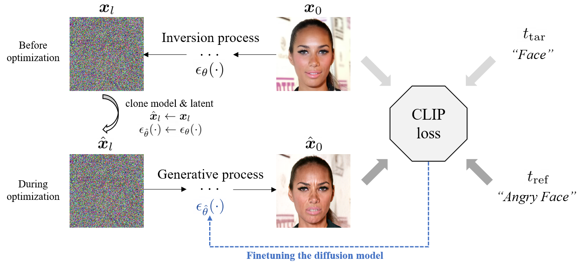
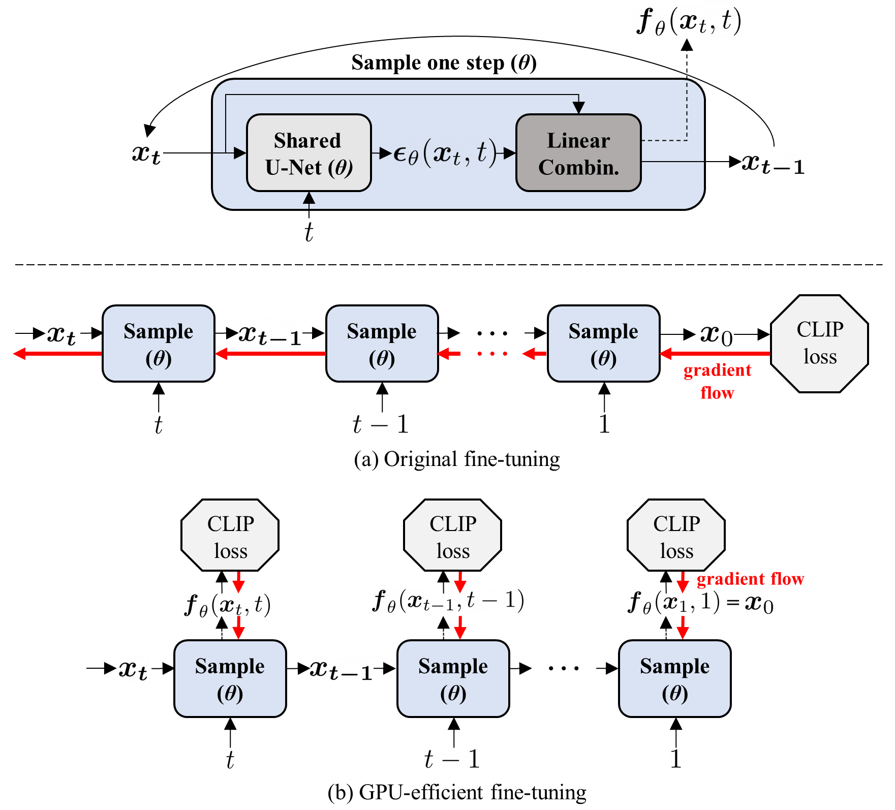
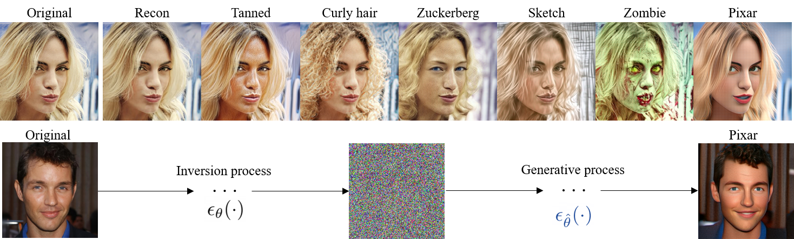
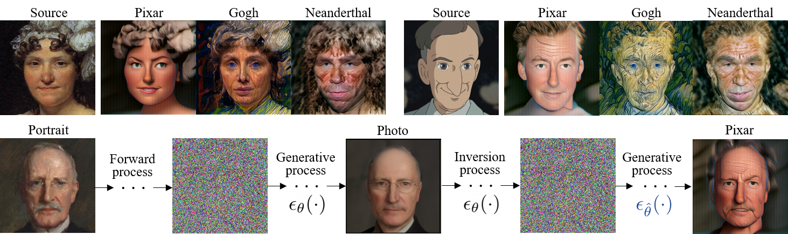
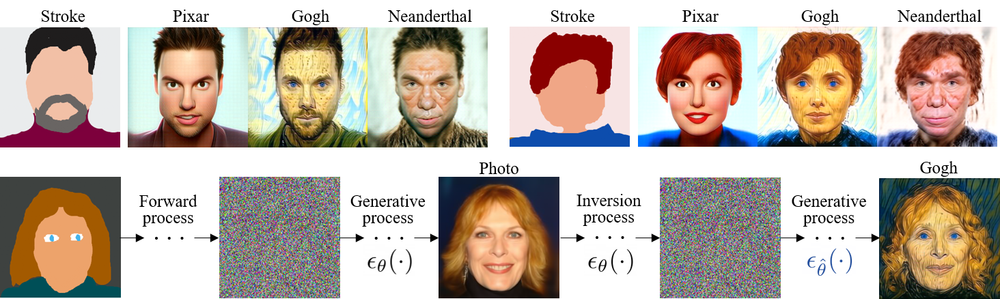
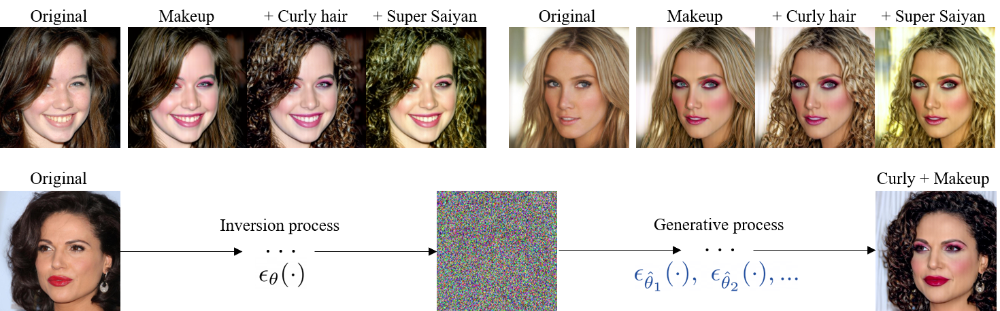

# DiffusionCLIP: Text-Guided Diffusion Models for Robust Image Manipulation (CVPR 2022) 

[](https://replicate.com/gwang-kim/diffusionclip) [](https://huggingface.co/gwang-kim/DiffusionCLIP-CelebA_HQ)
[](https://colab.research.google.com/drive/1n50M3cEGyU6O1DyB791fz43RwnbavPS4?usp=sharing) 

[](https://openaccess.thecvf.com/content/CVPR2022/html/Kim_DiffusionCLIP_Text-Guided_Diffusion_Models_for_Robust_Image_Manipulation_CVPR_2022_paper.html) [](https://arxiv.org/abs/2110.02711)
[](https://youtu.be/YVCtaXw6fw8) [](https://drive.google.com/file/d/1QgRFIRba492dCZ6v7BcZB9zqyp91aTjL/view?usp=sharing) 

<p align="center">

  

  

</p> 

[comment]: <> (![]&#40;imgs/main1.png&#41;)

[comment]: <> (![]&#40;imgs/main2.png&#41;)

> **DiffusionCLIP: Text-Guided Diffusion Models for Robust Image Manipulation**<br>
> [Gwanghyun Kim](https://gwang-kim.github.io/), Taesung Kwon, [Jong Chul Ye](https://bispl.weebly.com/professor.html) <br>
> CVPR 2022
> 
>**Abstract**: <br>
Recently, GAN inversion methods combined with Contrastive Language-Image Pretraining (CLIP) enables zero-shot image manipulation guided by text prompts. 
> However, their applications to diverse real images are still difficult due to the limited GAN inversion capability. 
> Specifically, these approaches often have difficulties in reconstructing images with novel poses, views, and highly variable contents compared to the training data, altering object identity, or producing unwanted image artifacts. 
> To mitigate these problems and enable faithful manipulation of real images, we propose a novel method, dubbed DiffusionCLIP, that performs text-driven image manipulation using diffusion models. 
> Based on full inversion capability and high-quality image generation power of recent diffusion models, our method performs zero-shot image manipulation successfully even between unseen domains 
> and takes another step towards general application by manipulating images from a widely varying ImageNet dataset.
> Furthermore, we propose a novel noise combination method that allows straightforward multi-attribute manipulation. 
> Extensive experiments and human evaluation confirmed robust and superior manipulation performance of our methods compared to the existing baselines.

## Description

This repo includes the official PyTorch implementation of DiffusionCLIP, Text-Guided Diffusion Models for Robust Image Manipulation.
DiffusionCLIP resolves the critical issues in zero-shot manipulation with the following contributions.
- We revealed that diffusion model is well suited for image manipulation thanks to its nearly **perfect inversion** capability, which is an important advantage over GAN-based models and hadn't been analyzed in depth before our detailed comparison.
- Our novel sampling strategies for fine-tuning can preserve perfect reconstruction at **increased speed**.
- In terms of empirical results, our method enables accurate **in- and out-of-domain manipulation**, minimizes unintended changes, and significantly outperformes SOTA baselines. 
- **Our method takes another step towards <span style="color:red">general application</span> by manipulating images from a <span style="color:red">widely varying ImageNet</span> dataset**.
- Finally, our **zero-shot translation between unseen domains** and **multi-attribute transfer** can effectively reduce manual intervention.

The training process is illustrated in the following figure. **Once the diffusion model is fine-tuned, any image from the pretrained domain can be manipulated into the corresponding to the target text without re-training**:
 


We also propose two fine-tuning scheme. Quick original fine-tuning and GPU-efficient fine-tuning. For more details, please refer to Sec. B.1 in Supplementary Material.



## Getting Started

### Installation
We recommend running our code using:

- NVIDIA GPU + CUDA, CuDNN
- Python 3, Anaconda

To install our implementation, clone our repository and run following commands to install necessary packages:
  ```shell script
conda install --yes -c pytorch pytorch=1.7.1 torchvision cudatoolkit=<CUDA_VERSION>
pip install -r requirements.txt
pip install git+https://github.com/openai/CLIP.git
```
### Resources
- For the original fine-tuning, VRAM of 24 GB+ for 256x256 images are required.  
- For the GPU-efficient fine-tuning, VRAM of 12 GB+ for 256x256 images and 24 GB+ for 512x512 images are required.   
- For the inference, VRAM of 6 GB+ for 256x256 images and 9 GB+ for 512x512 images are required.  

### Pretrained Models for DiffusionCLIP Fine-tuning

To manipulate soure images into images in CLIP-guided domain, the **pretrained Diffuson models** are required.

| Image Type to Edit |Size| Pretrained Model | Dataset | Reference Repo. 
|---|---|---|---|---
| Human face |256×256| Diffusion (Auto), [IR-SE50](https://drive.google.com/file/d/1KW7bjndL3QG3sxBbZxreGHigcCCpsDgn/view) | [CelebA-HQ](https://arxiv.org/abs/1710.10196) | [SDEdit](https://github.com/ermongroup/SDEdit), [TreB1eN](https://github.com/TreB1eN/InsightFace_Pytorch) 
| Church |256×256| Diffusion (Auto) | [LSUN-Bedroom](https://www.yf.io/p/lsun) | [SDEdit](https://github.com/ermongroup/SDEdit) 
| Bedroom |256×256| Diffusion (Auto) | [LSUN-Church](https://www.yf.io/p/lsun) | [SDEdit](https://github.com/ermongroup/SDEdit) 
| Dog face |256×256| [Diffusion](https://drive.google.com/file/d/14OG_o3aa8Hxmfu36IIRyOgRwEP6ngLdo/view) | [AFHQ-Dog](https://arxiv.org/abs/1912.01865) | [ILVR](https://github.com/jychoi118/ilvr_adm)
| ImageNet |512×512| [Diffusion](https://openaipublic.blob.core.windows.net/diffusion/jul-2021/512x512_diffusion.pt) | [ImageNet](https://image-net.org/index.php) | [Guided Diffusion](https://github.com/openai/guided-diffusion)
- The pretrained Diffuson models on 256x256 images in [CelebA-HQ](https://arxiv.org/abs/1710.10196), [LSUN-Church](https://www.yf.io/p/lsun), and [LSUN-Bedroom](https://www.yf.io/p/lsun) are automatically downloaded in the code.
- In contrast, you need to download the models pretrained on [AFHQ-Dog-256](https://arxiv.org/abs/1912.01865) or [ImageNet-512](https://image-net.org/index.php) in the table and put it in `./pretrained` directory. 
- In addition, to use ID loss for preserving Human face identity, you are required to download the pretrained [IR-SE50](https://drive.google.com/file/d/1KW7bjndL3QG3sxBbZxreGHigcCCpsDgn/view) model from [TreB1eN](https://github.com/TreB1eN/InsightFace_Pytorch)  and put it in `./pretrained` directory.


### Datasets 
To precompute latents and fine-tune the Diffusion models, you need about 30+ images in the source domain. You can use both **sampled images** from the pretrained models or **real source images** from the pretraining dataset. 
If you want to use **real source images**,  
- for [CelebA-HQ](https://drive.google.com/drive/folders/0B4qLcYyJmiz0TXY1NG02bzZVRGs?resourcekey=0-arAVTUfW9KRhN-irJchVKQ), and [AFHQ-Dog](https://github.com/clovaai/stargan-v2), you can use following code:    
```
# CelebA-HQ 256x256
bash data_download.sh celeba_hq .

# AFHQ-Dog 256x256
bash data_download.sh afhq .
```
- for [LSUN-Church](https://www.yf.io/p/lsun), [LSUN-Bedroom](https://www.yf.io/p/lsun) or [ImageNet](https://image-net.org/index.php), you can download them from the linked original sources and put them in `./data/lsun` or `./data/imagenet`.

If you want to use custom paths, you can simply modify `./configs/paths_config.py`.


### Colab Notebook [](https://colab.research.google.com/drive/1n50M3cEGyU6O1DyB791fz43RwnbavPS4?usp=sharing)
We provide a colab notebook for you to play with DiffusionCLIP! Due to 12GB of the VRAM limit in Colab, we only provide the codes of inference & applications with the fine-tuned DiffusionCLIP models, not fine-tuning code. 
We provide a wide range of types of edits, and you can also upload your fine-tuned models following below instructions on Colab and test them.


## DiffusionCLIP Fine-tuning 


To fine-tune the pretrained Diffusion model guided by CLIP, run the following commands:

```
python main.py --clip_finetune          \
               --config celeba.yml      \
               --exp ./runs/test        \
               --edit_attr neanderthal  \
               --do_train 1             \
               --do_test 1              \
               --n_train_img 50         \
               --n_test_img 10          \
               --n_iter 5               \
               --t_0 500                \
               --n_inv_step 40          \
               --n_train_step 6         \
               --n_test_step 40         \
               --lr_clip_finetune 8e-6  \
               --id_loss_w 0            \
               --l1_loss_w 1            
```
- You can use `--clip_finetune_eff` instead of `--clip_finetune` to save GPU memory.
- `config`: `celeba.yml` for human face, `bedroom.yml` for bedroom, `church.yml` for church, `afhq.yml` for dog face and , `imagenet.yml` for images from ImageNet.
- `exp`: Experiment name.
- `edit_attr`: Attribute to edit, you can use `./utils/text_dic.py` to predefined source-target text pairs or define new pair. 
  - Instead, you can use `--src_txts` and `--trg_txts`. 
- `do_train`, `do_test`: If you finish training quickly withouth checking the outputs in the middle of training, you can set `do_test` as 1.
- `n_train_img`, `n_test_img`: # of images in the trained domain for training and test.        
- `n_iter`: # of iterations of a generative process with `n_train_img` images.
- `t_0`: Return step in [0, 1000), high `t_0` enable severe change but may lose more identity or semantics in the original image.  
- `n_inv_step`, `n_train_step`, `n_test_step`: # of steps during the generative pross for the inversion, training and test respectively. They are in `[0, t_0]`. We usually use 40, 6 and 40  for `n_inv_step`, `n_train_step` and `n_test_step` respectively. 
   - We found that the manipulation quality is better when `n_***_step` does not divide `t_0`. So we usally use 301, 401, 500 or 601 for `t_0`.
- `lr_clip_finetune`: Initial learning rate for CLIP-guided fine-tuning.
- `id_loss_w`, `l1_loss` : Weights of ID loss and L1 loss when CLIP loss weight is 3.


## Novel Applications

The fine-tuned models through DiffusionCLIP can be leveraged to perform the several novel applications. 

### Manipulation of Images in Trained Domain & to Unseen Domain


You can edit one image into the CLIP-guided domain by running the following command:
``` 
python main.py --edit_one_image            \
               --config celeba.yml         \
               --exp ./runs/test           \
               --t_0 500                   \
               --n_inv_step 40             \
               --n_test_step 40            \
               --n_iter 1                  \
               --img_path imgs/celeb1.png  \
               --model_path  checkpoint/neanderthal.pth
```
- `img_path`: Path of an image to edit
- `model_path`: Finetuned model path to use

You can edit multiple images from the dataset into the CLIP-guided domain by running the following command:
```
python main.py --edit_images_from_dataset  \
               --config celeba.yml         \
               --exp ./runs/test           \
               --n_test_img 50             \
               --t_0 500                   \
               --n_inv_step 40             \
               --n_test_step 40            \
               --model_path checkpoint/neanderthal.pth
```
 

### Image Translation from Unseen Domain into Another Unseen Domain



###  Generation of Images in Unseen Domain from Strokes

You can tranlate images from an unseen domain to another unseen domain. (e.g. Stroke/Anime ➝ Neanderthal) using following command: 

```
python main.py --unseen2unseen          \
               --config celeba.yml      \
               --exp ./runs/test        \
               --t_0 500                \
               --bs_test 4              \
               --n_iter 10              \
               --n_inv_step 40          \
               --n_test_step 40         \
               --img_path imgs/stroke1.png \
               --model_path  checkpoint/neanderthal.pth
```
- `img_path`: Stroke image or source image in the unseen domain e.g. portrait
- `n_iter`: # of iterations of stochastic foward and generative processes to translate an unseen source image into the image in the trained domain. It's required to be larger than 8. 

### Multiple Attribute Changes

You can change multiple attributes thorugh only one generative process by mixing the noise from the multipe fintuned models.
1. Set `HYBRID_MODEL_PATHS` of `HYBRID_CONFIG` in `./configs/paths_config`. The keys of 
2. Run the commands for above **Manipulation of Images in Trained Domain & to Unseen Domain** with `--hybrid_noise 1`   

```
HYBRID_MODEL_PATHS = [
	'curly_hair.pth',
	'makeup.pth',
]

HYBRID_CONFIG = \
	{ 300: [1, 0],**
	    0: [0.3, 0.7]}
```

The keys and values of `HYBRID_CONFIG` dictionary correspond to thresholds and ratios for the noise mixing process using multiple models. The following pseudo-code represent the noise mixing process. The full codes are in `./utils/diffusion_utils.py`.
```
# models: list of the finetuned diffusion models 

for thr in list(HYBRID_CONFIG.keys()):
    if t >= thr:
        et = 0
        for i, ratio in enumerate(HYBRID_CONFIG[thr]):
            ratio /= sum(HYBRID_CONFIG[thr])
            et_i = models[i](xt, t)
            et += ratio * et_i
        break
```

## Finetuned Models Using DiffuionCLIP

We provide a Google Drive containing several fintuned models using DiffusionCLIP. [Human Face, Dog Face, Church, Bedroom](https://drive.google.com/drive/folders/1Uwvm_gckanyRzQkVTLB6GLQbkSBoZDZF?usp=sharing),
[ImageNet Style Transfer](https://drive.google.com/drive/folders/1Qb9jcv3Be3k7UtVQykI2PWqznUzb0t8R?usp=sharing), [ImageNet Tennis Ball](https://drive.google.com/drive/folders/1I3rhsPbEkQkWeoGW9kryv8nB_eLeHXfY?usp=sharing)

## Related Works

Usage of guidance by [CLIP](https://arxiv.org/abs/2103.00020) to manipulate images is motivated by [StyleCLIP](https://arxiv.org/abs/2103.17249) and [StyleGAN-NADA](https://arxiv.org/abs/2108.00946).
Image translation from an unseen domain to the trained domain using diffusion models is introduced in [SDEdit](https://arxiv.org/abs/2108.01073), [ILVR](https://arxiv.org/abs/2108.02938).
DDIM sampling and its reveral for generation and inversion of images are introduced by in [DDIM](https://arxiv.org/abs/2010.02502), [Diffusion Models Beat GANs on Image Synthesis](https://arxiv.org/abs/2105.05233).

Our code strcuture is based on the official codes of [SDEdit](https://github.com/ermongroup/SDEdit) and [StyleGAN-NADA](https://github.com/rinongal/StyleGAN-nada). We used pretrained models from [SDEdit](https://github.com/ermongroup/SDEdit) and [ILVR](https://github.com/jychoi118/ilvr_adm).


## Citation
If you find DiffusionCLIP useful in your research, please consider citing:

    @InProceedings{Kim_2022_CVPR,
        author    = {Kim, Gwanghyun and Kwon, Taesung and Ye, Jong Chul},
        title     = {DiffusionCLIP: Text-Guided Diffusion Models for Robust Image Manipulation},
        booktitle = {Proceedings of the IEEE/CVF Conference on Computer Vision and Pattern Recognition (CVPR)},
        month     = {June},
        year      = {2022},
        pages     = {2426-2435}
    }

## Additional Results

Here, we show more manipulation of real images in the diverse datasets using DiffusionCLIP where the original pretrained models
are trained on [AFHQ-Dog](https://arxiv.org/abs/1912.01865), [LSUN-Bedroom](https://www.yf.io/p/lsun) and [ImageNet](https://image-net.org/index.php), respectively.

[comment]: <> (![]&#40;imgs/more_manipulation1.png&#41;)

[comment]: <> (![]&#40;imgs/more_manipulation2.png&#41;)

[comment]: <> (![]&#40;imgs/more_manipulation3.png&#41;)

[comment]: <> (![]&#40;imgs/more_manipulation4.png&#41;)

<p align="center">

  

  

  

  

</p>
